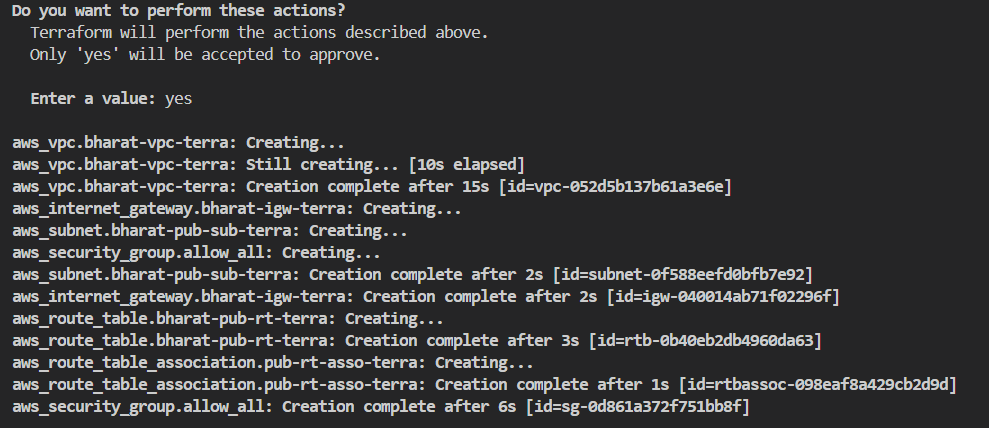
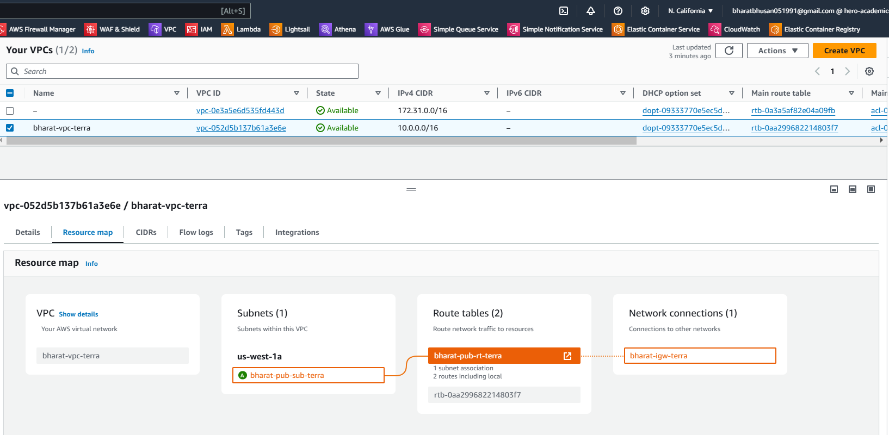
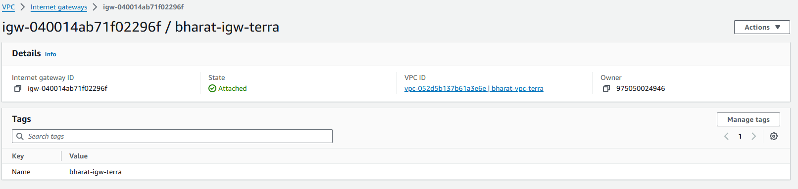
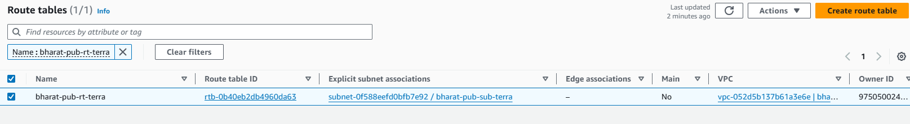
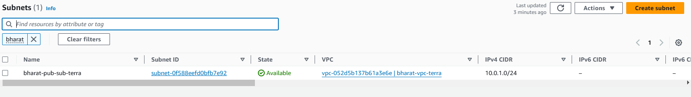
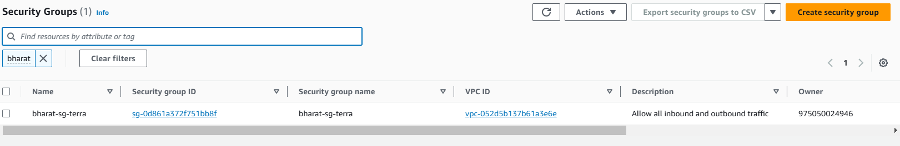
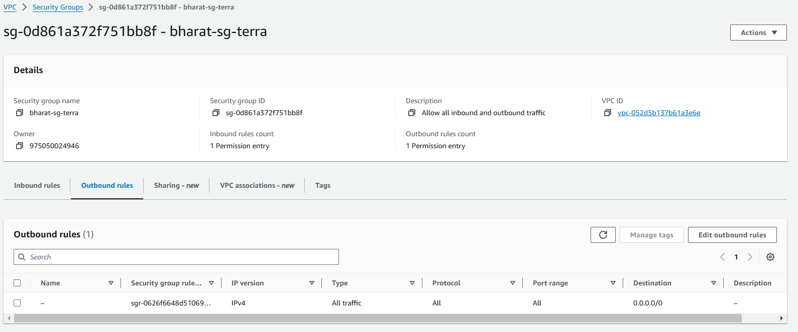
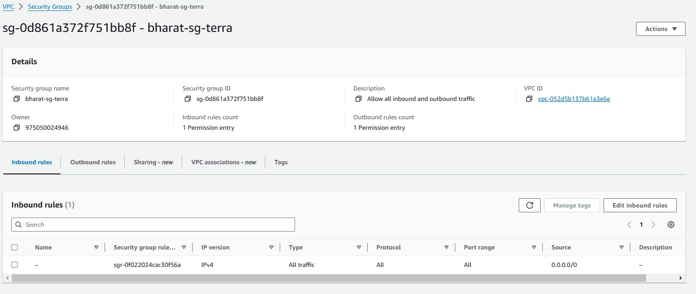
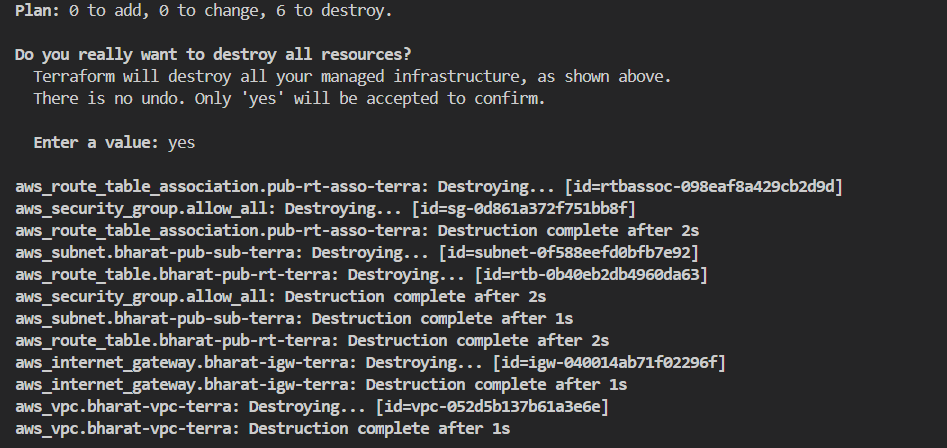

# 🌐 AWS VPC Setup with Terraform

This guide covers the creation of a Virtual Private Cloud (VPC) in AWS using Terraform. The configuration includes resources like a VPC, Internet Gateway, Public Subnet, Route Table, Route Table Association, and Security Group.

## 📋 Table of Contents
- [Introduction](#introduction)
- [Terraform Configuration Overview](#terraform-configuration-overview)
- [Resources](#resources)
  - [🛠️ Provider Configuration](#provider-configuration)
  - [🏢 VPC](#vpc)
  - [🌉 Internet Gateway](#internet-gateway)
  - [📦 Public Subnet](#public-subnet)
  - [🗺️ Route Table](#route-table)
  - [🔗 Route Table Association](#route-table-association)
  - [🔒 Security Group](#security-group)
- [Commands](#commands)
- [Conclusion](#conclusion)

---

## 🚀 Introduction

This Terraform configuration is designed to set up a basic networking infrastructure on AWS, including:
- A **VPC** to host network resources.
- An **Internet Gateway** for outbound internet access.
- A **Public Subnet** for resources that need internet access.
- A **Route Table** to route traffic.
- A **Security Group** with open ingress and egress rules.

## 🔧 Terraform Configuration Overview

The Terraform configuration file, `main.tf`, defines the infrastructure resources for a scalable and manageable AWS network setup. Below are the details for each resource.

---

## 🛠️ Provider Configuration

```hcl
provider "aws" {
  region = "us-west-1"
}
```

The AWS provider is configured to use the `us-west-1` region. Ensure your AWS credentials are configured correctly before running Terraform commands.

---

## 🏢 VPC

```hcl
resource "aws_vpc" "bharat-vpc-terra" {
  cidr_block           = "10.0.0.0/16"
  enable_dns_support   = true
  enable_dns_hostnames = true

  tags = {
    Name = "bharat-vpc-terra"
  }
}
```

### Description
The **VPC** (Virtual Private Cloud) serves as a virtual network within AWS. Here, we:
- Define a **CIDR block** of `10.0.0.0/16`.
- Enable **DNS support** and **DNS hostnames** for internal resolution.
- Tag it as `bharat-vpc-terra` for easy identification.

---

## 🌉 Internet Gateway

```hcl
resource "aws_internet_gateway" "bharat-igw-terra" {
  vpc_id = aws_vpc.bharat-vpc-terra.id

  tags = {
    Name = "bharat-igw-terra"
  }
}
```

### Description
The **Internet Gateway** (IGW) allows resources in the VPC to communicate with the internet. It's associated with the VPC and tagged as `bharat-igw-terra`.

---

## 📦 Public Subnet

```hcl
resource "aws_subnet" "bharat-pub-sub-terra" {
  vpc_id     = aws_vpc.bharat-vpc-terra.id
  cidr_block = "10.0.1.0/24"

  tags = {
    Name = "bharat-pub-sub-terra"
  }
}
```

### Description
A **Public Subnet** within the VPC is created with a smaller CIDR block (`10.0.1.0/24`). This subnet can host resources like EC2 instances that need public internet access.

---

## 🗺️ Route Table

```hcl
resource "aws_route_table" "bharat-pub-rt-terra" {
  vpc_id = aws_vpc.bharat-vpc-terra.id

  route {
    cidr_block = "0.0.0.0/0"
    gateway_id = aws_internet_gateway.bharat-igw-terra.id
  }

  tags = {
    Name = "bharat-pub-rt-terra"
  }
}
```

### Description
The **Route Table** defines routes for network traffic. Here, it:
- Routes all outbound traffic (`0.0.0.0/0`) to the **Internet Gateway**.
- Is tagged as `bharat-pub-rt-terra`.

---

## 🔗 Route Table Association

```hcl
resource "aws_route_table_association" "pub-rt-asso-terra" {
  subnet_id      = aws_subnet.bharat-pub-sub-terra.id
  route_table_id = aws_route_table.bharat-pub-rt-terra.id
}
```

### Description
The **Route Table Association** links the public subnet to the route table, ensuring all resources within the subnet use the specified routes.

---

## 🔒 Security Group

```hcl
resource "aws_security_group" "allow_all" {
  name        = "bharat-sg-terra"
  description = "Allow all inbound and outbound traffic"
  vpc_id      = aws_vpc.bharat-vpc-terra.id

  tags = {
    Name = "bharat-sg-terra"
  }

  ingress {
    from_port   = 0
    to_port     = 0
    protocol    = "-1"
    cidr_blocks = ["0.0.0.0/0"]
  }

  egress {
    from_port   = 0
    to_port     = 0
    protocol    = "-1"
    cidr_blocks = ["0.0.0.0/0"]
  }
}
```

### Description
The **Security Group** controls network traffic. This configuration:
- Allows **all inbound and outbound traffic** (`0.0.0.0/0`).
- Is tagged as `bharat-sg-terra`.

---

## 💻 Commands

Follow these commands to set up the infrastructure with Terraform:

1. **Initialize Terraform** 🛠️
   ```bash
   terraform init
   ```

2. **Create an Execution Plan** 📋
   ```bash
   terraform plan
   ```

3. **Apply the Configuration** 🚀
   ```bash
   terraform apply
   ```

4. **Destroy the Infrastructure** 🔥 (if needed)
   ```bash
   terraform destroy
   ```

---
## **Snapshots** :camera_flash: 
- Applying terraform code using "terraform apply"

- Verifiying the VPC 


- Verifiying the Internet-Gateway

- Verifiying the Route-Table

- Verifiying the Public Subnet

- Verifiying the Sercurity Group

- Verifiying the Sercurity Group - Inbound rules

- Verifiying the Sercurity Group - Outbound rules

- Destroying the infra using "terraform destroy"


## 🏁 Conclusion

This configuration establishes a basic AWS networking environment using Terraform, including a VPC, Internet Gateway, Subnet, Route Table, and Security Group. This setup enables the provisioning of resources with public access and flexible security rules.

Happy Building with Terraform! 🛠️🚀
```

This README file uses icons to make the document more engaging and organized, which will be particularly helpful for anyone following along. Let me know if you need further customization!
